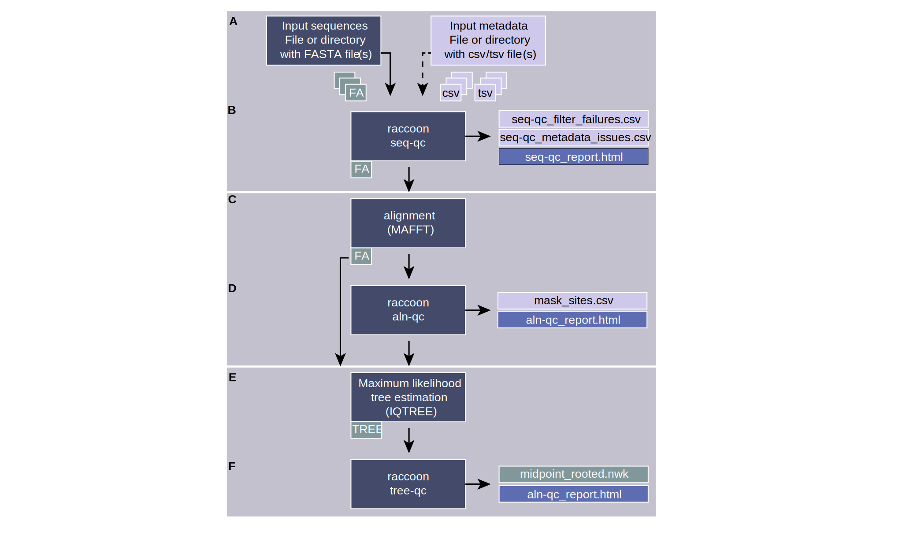

# raccoon-nf

  

<strong>Rigorous Alignment Curation: Cleanup Of Outliers and Noise</strong>

This is a nextflow implementation of https://github.com/artic-network/raccoon which you can access at https://github.com/Desperate-Dan/raccoon-nf. Raccoon is a lightweight toolkit for alignment and phylogenetic QC workflows. It identifies problematic sites (e.g., clustered SNPs, SNPs near Ns/gaps, and frame‑breaking indels) and produces mask files and summaries for downstream analyses. In depth details on Raccoon and it's workings can be found [here](https://github.com/artic-network/raccoon).

## Pipeline overview
The Raccoon Nextflow pipeline has only one mandatory input, which is either a single fasta file or a directory of fasta files. It then runs Raccoon seq-qc on the samples, followed by alignment with [mafft](https://pmc.ncbi.nlm.nih.gov/articles/PMC135756/), and then the Raccoon aln-qc module. The workflow can be stopped at this point if desired by choosing the `Only run alignment steps` option. You can optionally choose to mask the generated alignment using Raccoon mask at this stage by selecting `Run masking step`, or use an unmasked alignment file (default behaviour) for phylogenetic tree building using [IQ-TREE](https://iqtree.github.io/). If an outgroup has been provided an additional step will be carried out to prune the outgroup from the resulting treefile, before running the Raccoon tree-qc module. Below is a diagram of the Raccoon-nf workflow, with optional steps in orange boxes.

  

## Tutorial

A comprehensive tutorial covering sequence metadata harmonisation, multiple sequence alignment, alignment curation, phylogenetic inference, and tree assessment is available at [artic.network/tutorials/raccoon.nf](https://artic.network/tutorials/raccoon-nf). The tutorial includes:

- Step-by-step guidance on preparing sequence and metadata files.
- Instructions for running raccoon-nf through the EPI2ME interface.
- Interpretation of QC reports and identification of common data issues.
- Best practices for curating alignments and assessing phylogenetic results.
- Interactive exercises using provided example datasets.

The tutorial is suitable for both guided workshop delivery and self-paced learning.
